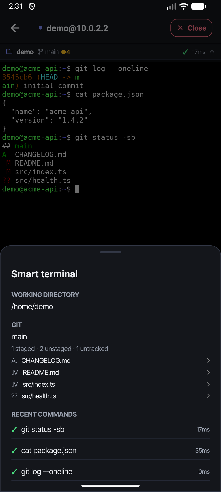
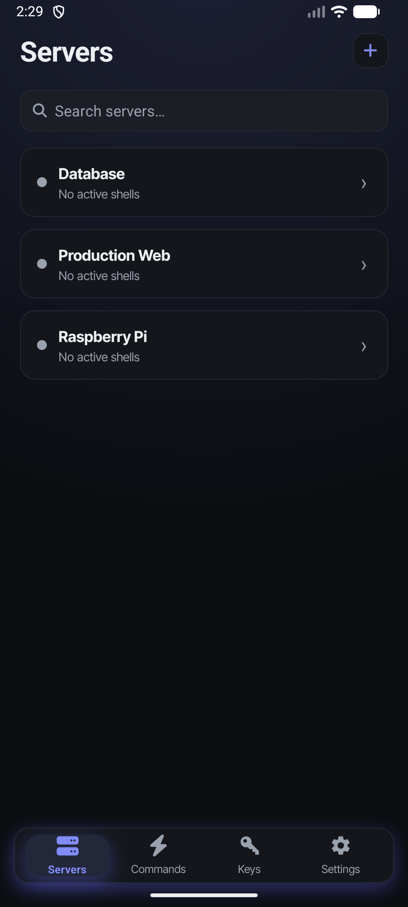
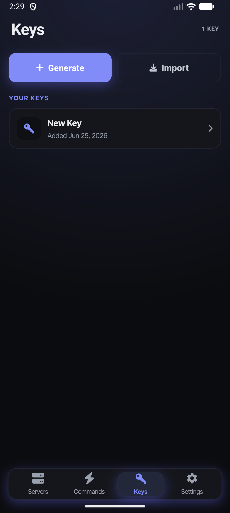

## Fressh

[Fressh](https://fressh.dev/) is an open-source mobile SSH client **powered by
[Alacritty](https://github.com/alacritty/alacritty)** — the real Alacritty
terminal engine and GPU renderer, running natively on your phone. It stays
clean and simple while supporting powerful features.

### Powered by Alacritty

Most mobile SSH clients render the terminal in a WebView. Fressh ships the
real thing: SSH bytes are parsed by
[`alacritty_terminal`](https://github.com/alacritty/alacritty) into a durable
`Term` state, and Alacritty's GLES renderer draws it directly (ANGLE→Metal on
iOS, GLES on Android). The data and render planes never cross into JS —
React Native only drives the chrome around the terminal.

- **Consistent visuals**: The render layer matches on both iOS and Android.
- **Performance**: Rendering stays off the JS thread.
- **Durability**: Terminal state lives in native code, so sessions reattach
  tmux-style with full scrollback.

Earlier versions rendered the terminal in a WebView running
[xterm.js](https://xtermjs.org/); that has been replaced by the native
Alacritty-based renderer.

### Features

- **Real Alacritty terminal**: Alacritty's VT engine + GPU renderer — no
  WebView
- **Secure connection history**: Connections are stored in the device keychain
- **SSH keys**: Generate ed25519 keys or import your own
- **Command presets**: One-tap commands on the terminal toolbar
- **Theming**: Multiple themes/skins
- **Session reattach**: tmux-style reattach with full scrollback on re-entry

### Coming soon

- **On-device AI**: On-device LLM for command completion and output
  summarization

### Screenshots

  
  
  
  

### Architecture

The app is a monorepo:

- **`apps/mobile`**: The React Native Expo app.
- **`apps/web`**: The [TanStack Start](https://tanstack.com/start) website
  ([fressh.dev](https://fressh.dev/)).
- **`packages/react-native-terminal`**: The native terminal package — SSH via
  [russh](https://github.com/Eugeny/russh), a durable VT engine via
  [`alacritty_terminal`](https://github.com/alacritty/alacritty), and
  Alacritty's native GLES renderer, all in one `.so`. It replaces the two
  earlier packages (`@fressh/react-native-uniffi-russh` and
  `@fressh/react-native-xtermjs-webview`).
- **`packages/assets`**: Shared icons, splash images, and screenshots.

### Why

Mostly to practice with React Native, Expo, and Rust. There are a few more
developed SSH clients on the Google Play and iOS App Stores.

Some of those try to lock features like one-off commands behind a paywall, so
this aims to be a free alternative.

### Changelogs

- `apps/mobile`: [`apps/mobile/CHANGELOG.md`](./apps/mobile/CHANGELOG.md)

### Contributing

We provide a Nix flake devshell to help get a working environment quickly. See
[`CONTRIBUTING.md`](./CONTRIBUTING.md) for details.

### License

MIT
