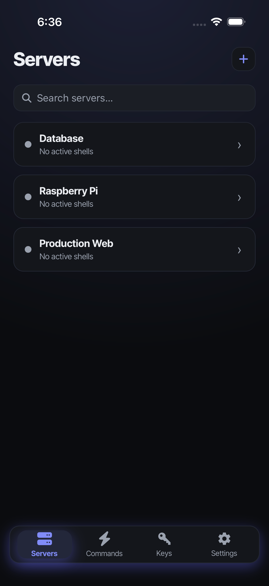
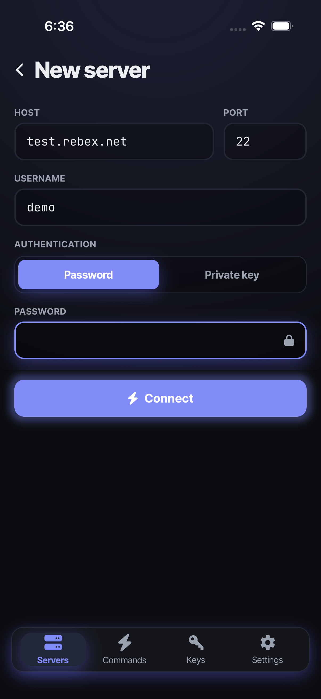
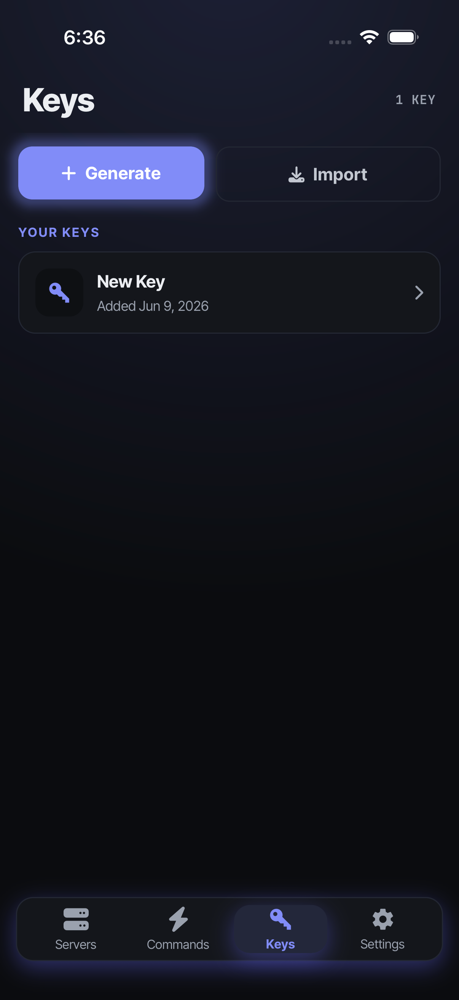

## Fressh

[Fressh](https://fressh.dev/) is a mobile SSH client that remains clean and
simple while supporting powerful features.

[](https://github.com/EthanShoeDev/fressh/actions/workflows/check.yml)

### Features

- **Secure connection history**: Connections are stored in the device keychain
- **SSH keys**: Generate ed25519 keys or import your own
- **Command presets**: One-tap commands on the terminal toolbar
- **Native terminal**: A native GLES renderer over a real VT engine — no WebView
- **Theming**: Multiple themes/skins
- **Session reattach**: tmux-style reattach with full scrollback on re-entry

### Coming soon

- **On-device AI**: On-device LLM for command completion and output
  summarization

### Screenshots





> Regenerate these with `bun run --filter @fressh/mobile screenshots` — see
> [Screenshots](#screenshots-automation) below.

### Architecture

The app is a monorepo:

- **`apps/mobile`**: The React Native Expo app.
- **`apps/web`**: The [Astro](https://astro.build/) website ([fressh.dev](https://fressh.dev/)).
- **`packages/react-native-terminal`**: The native terminal package — SSH via
  [russh](https://github.com/Eugeny/russh), a durable VT engine via
  [`alacritty_terminal`](https://github.com/alacritty/alacritty), and a native
  GLES renderer, all in one `.so`. It replaces the two earlier packages
  (`@fressh/react-native-uniffi-russh` and `@fressh/react-native-xtermjs-webview`).
- **`packages/assets`**: Shared icons, splash images, and screenshots.

### Why

Mostly to practice with React Native, Expo, and Rust. There are a few more
developed SSH clients on the Google Play and iOS App Stores.

Some of those try to lock features like one-off commands behind a paywall, so
this aims to be a free alternative.

The notable architectural choice is the **native terminal renderer**. SSH bytes
are parsed by `alacritty_terminal` into a durable `Term` state, and alacritty's
GLES renderer draws it directly — the render and data planes never cross into
JS. Benefits:

- **Consistent visuals**: The render layer matches on both iOS and Android.
- **Performance**: Rendering stays off the JS thread.

Earlier versions rendered the terminal in a WebView running
[xterm.js](https://xtermjs.org/); that has been replaced by the native renderer
(ANGLE→Metal on iOS, GLES on Android).

<h3 id="screenshots-automation">Screenshots automation</h3>

Marketing screenshots are produced by a [Maestro](https://maestro.mobile.dev/)
flow that drives the app and captures every screen for both platforms:

```bash
# 1. Build + run a seed variant (pre-populates demo servers/commands).
#    The flag is inlined by Metro for debug builds, so set it on launch:
EXPO_PUBLIC_SCREENSHOT_SEED=1 bun run --filter @fressh/mobile ios     # or: android

# 2. Capture into packages/assets/mobile-screenshots/.
bun run --filter @fressh/mobile screenshots                          # both platforms
bun run --filter @fressh/mobile screenshots:ios                      # or one
```

The flow lives at `apps/mobile/test/e2e/screenshots.yml`; the runner is
`apps/mobile/scripts/screenshots.ts`. Maestro is included in the Nix devshell
(otherwise: `curl -Ls "https://get.maestro.mobile.dev" | bash`).

### Changelogs

- `apps/mobile`: [`apps/mobile/CHANGELOG.md`](./apps/mobile/CHANGELOG.md)

### Contributing

We provide a Nix flake devshell to help get a working environment quickly. See
[`CONTRIBUTING.md`](./CONTRIBUTING.md) for details.

### License

MIT
